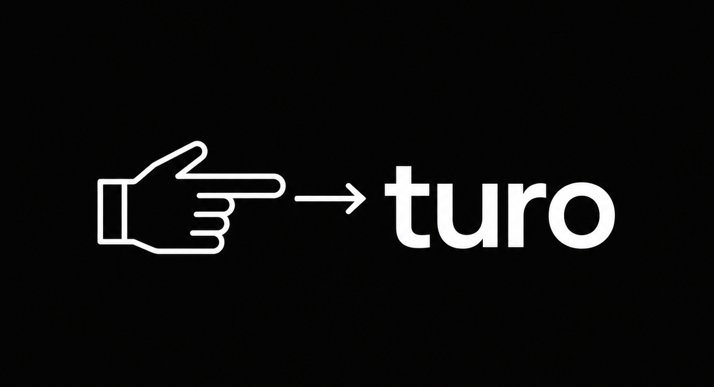

<p align="center">
  
</p>

<p align="center">
  <strong>Point more. Token less.</strong>
</p>

```
the quick brown fox jumps all over the lazy dog
```

becomes:

```
quick brown fox jumps lazy dog
```

No articles. No prepositions. No adverbs. No repeated words. Only the content words that carry meaning, deduplicated, in reading order. Measured ~70% fewer input tokens on real docs (README 1029 -> 306 tokens).

Why not arrows? A `A → B` edge list repeats shared nodes and the arrow itself tokenizes to extra tokens — it makes text *bigger*. Turo drops every token that does not earn its place. If a reduction is not smaller than the input, turo passes the original through unchanged.

Turo is a skill/plugin for Claude Code, Codex, Gemini, Cursor, Windsurf, Cline, Copilot, and 30+ other agents. Install once. Every agent gets the same reducer — code, commands, and errors stay byte-for-byte exact. You save input tokens on every turn, forever.

## Install

| Method | Command |
|--------|---------|
| **npx** | `npx turo` |
| **Homebrew** | `brew install kdeps/tap/turo` |
| **Go** | `go install github.com/kdeps/turo@latest` |
| **Shell** | `curl -fsSL https://raw.githubusercontent.com/kdeps/turo/main/install.sh | sh` |
| **Manual** | Download from [releases](https://github.com/kdeps/turo/releases) |

## Usage

```bash
cat CLAUDE.md | turo              # text -> deduped content words
echo "fox jumps over dog" | turo  # pipe mode
turo --preamble                   # wrap for system prompt injection
turo --version                    # print version
```

## Intensity levels

| Level | What it keeps | Reduction |
|-------|--------------|-----------|
| **lite** | Adjectives, nouns, verbs, and leftover adverbs/prepositions | ~65% |
| **full** (default) | Adjectives, nouns, verbs | ~70% |
| **ultra** | Nouns and verbs only, deduplicated by lemma (base form) | ~70%+ |

```bash
echo "the quick brown fox jumps over the lazy dog" | turo --level lite   # quick brown fox jumps over lazy dog
echo "the quick brown fox jumps over the lazy dog" | turo --level full   # quick brown fox jumps lazy dog
echo "the quick brown fox jumps over the lazy dog" | turo --level ultra  # fox jump dog
```

In **ultra**, inflections of the same word collapse to one token by their
dictionary base form: `goes`, `went`, `going` -> `go`; `children` -> `child`;
`servers` -> `server`. A reduction is only applied when it lands on a real
dictionary word, so no mangled non-words are ever emitted.

Set default via `TURO_LEVEL` env var.

## Integration

`npx turo` installs the binary **and** registers the turo skill + `/turo`
command with every coding agent it finds on your machine — Claude Code, Gemini
CLI, opencode, Codex, Cursor, Windsurf, Cline, Copilot, and 20+ more. Install
once; every agent gets the same reducer.

```bash
npx turo                 # binary + register with detected agents
npx turo --list          # show every supported agent and its status
npx turo --only claude   # register with one agent
npx turo --all           # register with every supported agent
npx turo --no-binary     # register agents only (binary already installed)
npx turo --uninstall     # remove binary + registered skills
```

Under the hood each agent gets one of:

- **Claude Code / opencode** — the skill and `/turo` command are copied into the agent's config dir
- **Gemini CLI** — `gemini extensions install`
- **everything else** — `npx skills add kdeps/turo --skill turo -a <profile>`

Once turo is on PATH, any agent can also pipe context through it directly:

```bash
cat CLAUDE.md | turo --preamble    # compact system prompt
cat error.log | turo               # reduce log output
```

Set `TURO_LEVEL=ultra` for maximum compression. `KDEPS_TURO=off` or `TURO_DISABLED=1` to disable.

## What it does NOT touch

- Code blocks and inline code — passed through unchanged
- URLs, file paths, version numbers — verbatim
- Technical terms (API names, CLI commands, error strings) — exact

## How it works

1. Embedded English dictionary (120k words, 14MB) classifies every word
2. Strips articles, prepositions, conjunctions, pronouns (~70 stop words)
3. Keeps the content words for the level (nouns, verbs, adjectives)
4. Deduplicates and emits them in reading order — then keeps the result only if it is actually smaller than the input

## Why

System prompts are 50-200k tokens. Most of those words carry grammar, not meaning. Turo points at what matters and drops the rest.

Point more. Token less.
