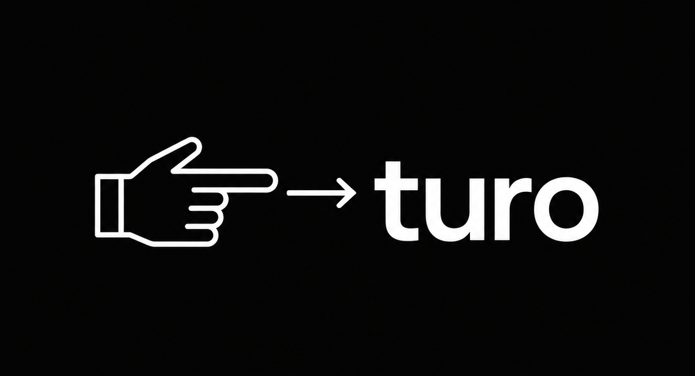

<p align="center">
  
</p>

<p align="center">
  <strong>Point more. Token less.</strong>
</p>

A real instruction block — **150 tokens** (cl100k):

```
When you are reviewing a pull request, please make sure that you carefully
examine each of the changed files and verify that the new code does not
introduce any regressions in the existing behavior. Missing tests lead to
untested code which produces subtle breaks that are difficult to debug later,
so check whether the author has added appropriate tests for the new
functionality. Updated docs and clear commit messages result in easier review;
confirm that the documentation has been updated to reflect the changes and that
the commit messages explain what was changed and why. Security issues such as
unsanitized user input or hardcoded credentials cause real risk, so you must
flag them immediately — that request results in changes before the pull request
can be merged.
```

becomes **48 tokens — 68% fewer** (`turo`, default `--level ultra`), with
causal chains reduced to `->`:

```
Review pull request make change file verify code bring act exist
behavior miss test -> untested -> break debug later check author add
updated docs commit message -> easier confirm documentation reflect
security issue unsanitized user input hardcoded -> real risk must flag
-> merge
```

or **59 tokens — 61% fewer** at `--level full` (adjectives kept, no lemma collapse):

```
Reviewing pull request make changed files verify new code bring
regressions existing behavior missing tests -> untested -> subtle
breaks debug later check author added appropriate functionality
updated docs clear commit messages -> easier review confirm
documentation reflect changes explain security issues unsanitized user
input hardcoded credentials -> real risk must flag -> merged
```

or **121 characters** with `--level wenyan`, which additionally swaps each
word for a single Classical Chinese character (for CJK-tokenizer models — see
[wenyan](#wenyan-cjk-tokenizer-models-only)):

```
閱引請作變檔驗碼 bring act 存為 miss 試 -> untested -> 破診後查者增更 docs 交訊 -> easier 證文映安題 unsanitized 戶入 hardcoded -> real risk 須標 -> 併
```

775 → 121 characters (30 Han chars). Token counts for that output:

| tokenizer | tokens |
|-----------|--------|
| Qwen / DeepSeek / GLM (~1 per Han char) | **~45** |
| OpenAI cl100k (2–3 per Han char) | 77 |

So wenyan is competitive on CJK-tokenizer models (~45) but loses on OpenAI
(77 vs ultra's 48) — use it only with CJK models. See below.

No articles. No prepositions. No adverbs. No repeated words. Only the content
words that carry meaning, deduplicated, in reading order. Every prompt, every
turn — the savings compound. If a reduction is not smaller than the input, turo
passes the original through unchanged.

Install turo once and any coding agent that can shell out to a binary — Claude Code, Codex, Gemini, Cursor, Windsurf, Cline, Copilot, and 20+ more — pipes its context through the same reducer. Code, paths, and identifiers pass through untouched.

## Install

| Method | Command |
|--------|---------|
| **Homebrew** | `brew install kdeps/tap/turo` |
| **Go** | `go install github.com/kdeps/turo@latest` |
| **Shell** | `curl -fsSL https://raw.githubusercontent.com/kdeps/turo/main/install.sh \| sh` |
| **Manual** | Download from [releases](https://github.com/kdeps/turo/releases) |

## Quick start

```bash
brew install kdeps/tap/turo   # or any method above
turo run claude               # launch your agent with every request reduced —
                              # base URL wired for you, 60-90% fewer input tokens
turo doctor                   # verify the install + agent wiring
turo gain                     # tokens saved so far
```

`turo run <agent>` is the everyday driver: it starts an in-process proxy, points
the agent's base-URL env var at it, and reduces every request — no config, no API
keys touched. Run `turo run` to list supported agents ([details below](#proxy--reduce-every-request-for-any-agent)).
The flags below are for tuning or one-off pipe use.

## Usage

```bash
cat CLAUDE.md | turo              # text -> deduped content words
echo "fox jumps over dog" | turo  # pipe mode
turo -passes 1                    # single pass (default runs to convergence)
turo -filler=false                # skip filler deletion
turo -synonyms=false              # skip the synonym pass (keep words verbatim)
turo -gloss=false                 # skip the defining-word swap (less lossy)
turo -defmatch=false              # keep definition-like phrases (skip the phrase -> headword swap)
turo -arrows=false                # keep connectives verbatim (skip multi- and single-word -> swaps)
turo gain                         # estimated tokens saved so far
turo gain --history               # per-reduction history, newest first
turo gain --json                  # same totals as JSON for scripts/dashboards
turo discover                     # tokens turo could save on your Claude Code history
turo discover --json              # discover totals as JSON
turo doctor                       # health check: version, settings, paths, agent wiring
turo --version                    # print version
```

`-gloss` (on by default) replaces each word with the shortest
same-part-of-speech word from its own dictionary definition (`approach` ->
`come`). Definitions are prose, not synonyms, so it is the lossiest stage —
disable it with `-gloss=false` / `TURO_GLOSS=off` when you need words closer to
the original.

`-defmatch` (on by default) runs the gloss trade in reverse: where `-gloss`
swaps a word for one of its defining words, `-defmatch` collapses a whole
definition-like phrase into the word it defines (`the state of disorder and
lawlessness` -> `anarchy`). It slides a 2–6 word window and replaces only when
every keyword of a headword's definition is present, any surplus word is a bland
carrier noun (`person`, `state`, `thing`), and the headword is strictly cheaper
in tokens. Those gates are strict by design: on technical text it makes **zero**
replacements — README output here is byte-identical with it on or off — for
~315 KB of generated tables and ~2 ms per reduction. It earns its keep on
natural prose. Disable with `-defmatch=false` / `TURO_DEFMATCH=off`.

Stage order matters, and the pipeline runs phrase-level stages before word-level
ones: arrows, then filler deletion, then `-defmatch`, then `-gloss`, then
`-synonyms`, then the reduction to content words. A phrase matcher has to see the
phrase — one gloss swap inside it (`disorder` -> something shorter) is enough to
lose the match. Headwords `-defmatch` produces are then held back from the
later swaps, which would otherwise walk the match straight back (`anarchy` ->
`law`, inverting it). Between the two word-level swaps the ordering is close to a
wash on any single document — gloss-first is one token cheaper across a full
README — but a sweep of all 120 stage permutations over mixed corpora puts every
gloss-before-synonyms order in the cheapest tier, three tokens ahead of the
inverse. Arrow and filler placement is free; only the two phrase-then-word
constraints (defmatch before gloss, gloss before synonyms) cost anything.

`-arrows` (on by default) rewrites causal, sequential, and transformation
connectives to a single `->` token the reducer keeps between surviving content
words. The table is **440** entries:

- **Multi-word** (338) always save tokens: `leads to`, `results in`,
  `gives rise to`, `which produces`, `brings about`, `culminates in`,
  `paves the way for`, `followed by`, `falls back to`, `compiles to`,
  `evaluates to`, `desugars to`, `resolves to`, `defaults to`,
  `is rewritten as`, …
- **Single-word** (102) normalize vocabulary so later stages see one form:
  `therefore`, `thus`, `hence`, `becomes`, `yields`, `triggers`, `implies`,
  `spawns`, `generates`, `enables`, … Bare `so` / `then` stay literal (too
  common to rewrite safely).

Longest match wins. Reverse-causal phrases that name the cause *after* the
effect (`due to`, `because of`, `stems from`, `caused by`, `driven by`) are
excluded — and single-word verbs do not fire when followed by `by`/`from` —
so an arrow never points the wrong way. Disable with `-arrows=false` /
`TURO_ARROWS=off`.

```text
A cache miss leads to a slow query which produces a timeout
  =>  Cache miss -> slow query -> timeout

Timeout causes Retry and therefore Backoff
  =>  Timeout -> Retry -> Backoff

defaults to zero
  =>  -> zero

compiles to bytecode
  =>  -> bytecode

evaluates to true
  =>  -> true

the call falls back to the cache
  =>  Call -> cache

the macro desugars to a loop
  =>  Macro -> loop

the outage caused by a bad deploy
  =>  Outage cause bad deploy
```

## Savings — `turo gain`

Every reduction (pipe mode, the proxy, and `turo run`) appends an estimated
before/after token count to a JSONL log in your OS config dir
(`~/Library/Application Support/turo/` on macOS, `~/.config/turo/` on Linux;
override with `TURO_HOME`). `turo gain` totals it up; `turo gain --history` lists
recent reductions newest-first.

Counts of 1 000+ print with a magnitude suffix (`k` / `m` / `g` / `t`);
smaller values stay plain integers.

```text
turo gain — 42 reductions
  tokens in     8.14k
  tokens out    2.61k
  tokens saved  5.53k (67%)

by folder:
  ~/Projects/turo        31 reductions  saved 4.1k (69%)
  ~/Projects/api          11 reductions  saved 1.43k (61%)
```

Each event also records the working folder it ran in, so `turo gain` breaks the
savings down per project (busiest first) and `turo gain --history` shows the
folder for each reduction.

Add `--json` to either command for the same numbers in machine form — totals,
raw (un-abbreviated) token counts, integer percentages, and the per-folder
breakdown — so you can pipe savings into a dashboard, a CI check, or `jq`:

```console
$ turo gain --json | jq '.tokens_saved, .saved_pct'
5530
67
```

Counts are estimates from the built-in `cl100k`-style approximation, not a real
tokenizer — treat them as a trend, not a bill.

## Missed savings — `turo discover`

`turo gain` totals reductions that happened. `turo discover` shows the ones that
didn't: it scans your existing Claude Code history and estimates how many tokens
turo would have saved had those sessions run through the proxy.

Counts use the same `k` / `m` / `g` / `t` suffixes as `turo gain`.

```text
turo discover — scanned 403 sessions in ~/.claude/projects
  messages       53.01k reducible (all roles)
  tokens in      13.52m
  would be out   6.25m
  would save     7.28m (53%)

by project:
  ~/Projects/api          29.49k msgs  saved 3.24m (49%)
  ~/Projects/web          19.94k msgs  saved 3.14m (57%)

these sessions ran without turo — capture the savings next time with:
  turo run claude
```

It reads the per-project session logs under `~/.claude/projects` (set
`CLAUDE_CONFIG_DIR` if Claude Code stores them elsewhere), applying the same role
gating and compression flags (`-level`, `-filler`, `-gloss`, `-arrows`,
`-proxy-all`) as the proxy — so the estimate reflects what `turo run claude`
would actually do. Nothing is sent anywhere; the scan is local and read-only.

## Health check — `turo doctor`

`turo doctor` runs a local health check and exits non-zero if anything is
broken — useful in CI, install scripts, or after an upgrade to confirm turo is
wired up correctly.

Event counts, session totals, and the self-test token figures use the same
`k` / `m` / `g` / `t` magnitude suffixes as `turo gain` (values under 1 000 stay
plain integers — e.g. `22 -> 5`).

```text
turo doctor

turo
  · version dev (unreleased build)
  · binary /usr/local/bin/turo
  ✓ default level ultra (all roles)

environment
  · no turo env overrides set (using defaults)

gain log
  ✓ writable: ~/Library/Application Support/turo/gain.jsonl (3.03k events)

claude history (turo discover source)
  ✓ 420 session logs in ~/.claude/projects

pipeline self-test
  ✓ 22 -> 5 tokens (77% smaller) at level ultra

agents
  ✓ Claude Code — detected, skill installed
  ✓ opencode — detected, skill installed
  · Gemini CLI — detected
  · Cursor — detected
  · Qwen Code — detected
  · 5 of 18 supported agents detected (turo -list-agents shows all)

turo is healthy
```

What it checks:

| Section | What it verifies |
|---------|-----------------|
| **turo** | Version string, binary path, default level validity |
| **environment** | Lists any `TURO_*` env overrides that are set |
| **gain log** | Gain directory creatable, log file writable, event count (`N{k,m,g,t}`) |
| **claude history** | Session logs found under `~/.claude/projects` (`N{k,m,g,t}`) |
| **pipeline self-test** | Runs `reduce()` on a sample sentence, confirms token count decreased |
| **agents** | Detects installed coding agents, checks skill installation for native agents |

Pass `-level <name>` to test a specific level; an invalid level is reported as a
problem (✗) rather than a hard exit, so the full report is still visible.

```bash
turo doctor               # healthy -> exit 0
turo -level bogus doctor  # invalid level -> exit 1
```

## Pipeline

Every run is six stages, each on by default, phrase-level before word-level.
Stage separators below are `|` — the rewrite token `->` only appears inside stage 1.

```text
text
  | [1] arrow rewrite (connectives => ->)
  | [2] delete filler
  | [3] phrase to headword
  | [4] swap defining words
  | [5] swap cheaper synonyms
  | [6] reduce to content words
  | (stage 1 re-runs after each of 2–6 so new connectives still become ->)
```

1. **Arrow rewrite** replaces causal/sequential/transformation connectives
   (multi-word *and* single-word: `leads to`, `therefore`, `becomes`,
   `falls back to`, …) with a single `->` token. It runs at the start of each
   pass **and again after stages 2–6**, so connectives those stages reveal still
   become arrows; adjacent `->` runs and stopword-only gaps (`-> and ->`) are
   collapsed so you never get `-> -> ->` artifacts. Reverse-causal phrases
   (`caused by`, `due to`) stay put. Disable with `-arrows=false` /
   `TURO_ARROWS=off`.
2. **Filler deletion** removes pleasantries, hedges, and leaders that survive
   word-level stopword lists (`please`, `I think`, `of course`, `let me`),
   while protecting code, paths, URLs, and identifiers verbatim. Disable with
   `-filler=false` / `TURO_FILLER=off`.
3. **Definition match** collapses a definition-like phrase into the word it
   defines (`the state of disorder and lawlessness` -> `anarchy`). Disable with
   `-defmatch=false` / `TURO_DEFMATCH=off`.
4. **Gloss swap** replaces words with the shortest defining word from their
   dictionary definition — the lossiest stage. Disable with `-gloss=false` /
   `TURO_GLOSS=off`.
5. **Synonym swap** replaces words with a fewer-token synonym (see below).
   Disable with `-synonyms=false` / `TURO_SYNONYMS=off`.
6. **Reduction** drops the remaining stopwords, keeps content words by part of
   speech, deduplicates, and (ultra) collapses inflections by lemma.

Headwords stage 3 produces are held back from stages 4 and 5, which would
otherwise swap the match straight back (`anarchy` -> `law`, inverting it).

The whole pipeline repeats until the output stops changing (`-passes 0`, the
default; a positive `-passes N` caps the count). The first pass keeps document
structure (headings, per-section bodies); later passes flatten that and dedupe
across it, so large structured docs keep shrinking before converging — this
README goes ~4.9k (1 pass) → ~4.83k tokens (converged, estimateTokens). Set
`-passes 1` to keep it single-shot.

turo never emits output larger than the input: if a stage does not save tokens,
the text passes through unchanged.


### Synonym substitution (on by default, lossy)

turo runs a first pass that replaces each word with a fewer-token synonym before
reducing (`utilize` -> `use`, `demonstrate` -> `show`). The table is built from
**WordNet synsets** (real synonyms) and frequency-filtered so swaps land on
common words, then gated to same-part-of-speech words and validated to cost
strictly fewer tokens. turo still passes the original through if the result is
not smaller.

Disable it with `-synonyms=false` or `TURO_SYNONYMS=off` when you need words
verbatim. The gain is usually small — modern tokenizers
already encode most words as a single token. WordNet polysemy also leaves some
noise (`leverage` -> `purchase`), so keep it opt-in for prose, not code. The
table is generated by `tools/gensyn.py` (WordNet + wordfreq + the cl100k
tokenizer), so token counts are measured for cl100k, not the target model's
tokenizer.

## Intensity levels

| Level | What it keeps | Reduction (demo block) |
|-------|--------------|------------------------|
| **lite** | Adjectives, nouns, verbs, and leftover adverbs/prepositions | ~58% (63 tok) |
| **full** | Adjectives, nouns, verbs | ~61% (59 tok) |
| **ultra** (default) | Nouns and verbs only, deduplicated by lemma (base form) | ~68% (48 tok) |
| **wenyan** | ultra, then swap surviving words for a single 文言 (Classical Chinese) character | CJK models only |

```bash
echo "the quick brown fox jumps over the lazy dog" | turo --level lite   # quick brown fox jumps over lazy dog
echo "the quick brown fox jumps over the lazy dog" | turo --level full   # quick brown fox jumps lazy dog
echo "the quick brown fox jumps over the lazy dog" | turo --level ultra  # fox jump dog
echo "the wise king studies the old book" | turo --level wenyan    # 智王學舊書
```

### wenyan (CJK-tokenizer models only)

`wenyan` reduces at ultra, then swaps each surviving English content word
for one Classical Chinese character (`water` -> `水`, `king` -> `王`, `verify` ->
`驗`) from a ~480-entry hand-curated lexicon. One char per concept, no spaces
(Classical Chinese has none).

Two examples, measured:

| input | ultra | wenyan | chars | cl100k | CJK-model (~1/char) |
|-------|-------|--------------|-------|--------|----------------------|
| `The wise king uses water and fire so the person can see the hill and the old tree` (81 ch / 18 tok) | `Wise king use water fire person see hill old tree` (49 ch / 11 tok) | `智王用水火人見 hill 舊樹` | **15** | 16 | **~10** |
| the PR-review paragraph (775 ch / 150 tok) | 281 ch / 48 tok | `閱引請作變檔驗碼 bring act 存為 miss 試 -> untested -> 破診後查者增更 docs 交訊 -> easier 證文映安題 unsanitized 戶入 hardcoded -> real risk 須標 -> 併` | **121** | 77 | **~45** |

It collapses to the fewest **characters** (775 → 121 on the paragraph). A CJK
character is 2–3 tokens on OpenAI's cl100k, so `wenyan` is *larger* there
(77 > 48). **Use it only on CJK-optimized tokenizers** (Qwen, DeepSeek, GLM),
where a common character is ~1 token — then those 121 chars are ~45 tokens
(competitive with ultra). Don't use it with OpenAI models.

turo's own token estimator counts CJK as 1 rune = 1 token (matching those
models), so it treats `wenyan` as a reduction and never rejects it. Words
outside the lexicon stay English (`untested`, `unsanitized`, `hardcoded`
above); code/paths/URLs are preserved verbatim. Extend `wenyanMap` for more
coverage.

In **ultra**, inflections of the same word collapse to one token by their
dictionary base form: `goes`, `went`, `going` -> `go`; `children` -> `child`;
`servers` -> `server`. A reduction is only applied when it lands on a real
dictionary word, so no mangled non-words are ever emitted.

Set default via `TURO_LEVEL` env var.

## Proxy — reduce every request for any agent

To compress **all** input for an agent that turo can't reach from the inside
(Claude Code, Codex, ...), route the agent's requests through turo.

### `turo run` — launch an agent with everything reduced (turnkey)

```bash
turo run claude          # every claude request reduced, base URL wired for you
turo run codex           # OPENAI_BASE_URL wired instead
turo run grok            # GROK_CLI_CHAT_PROXY_BASE_URL -> cli-chat-proxy.grok.com
turo run                 # list supported agents
```

`turo run` starts an in-process proxy on a free port, points the agent's
base-URL env var at it (`ANTHROPIC_BASE_URL` for claude, `OPENAI_BASE_URL` for
OpenAI-compatible agents, `GROK_CLI_CHAT_PROXY_BASE_URL` for Grok Build), execs
the agent, and stops the proxy when it exits. One command, no exports, no
`/turo` inside the agent. Supported: `claude`, `codex`, `opencode`, `qwen`,
`aider`, `crush`, `goose`, `amp`, `grok`.

### `turo -proxy` — the proxy on its own

```bash
turo -proxy -upstream https://api.openai.com   # silent by default, listens on 127.0.0.1:8787
turo -proxy -proxy-verbose                      # print activity: token summary + before -> after text
turo -proxy -proxy-all=false                    # reduce only user + tool, not every role
turo -proxy -proxy-safe-mode                    # keep tool I/O + code/tables verbatim (reduced by default)
export OPENAI_BASE_URL=http://127.0.0.1:8787/v1
```

Every `/chat/completions`, Anthropic `/messages`, and OpenAI Responses
`/responses` (Grok Build) request has its message content reduced before it
reaches the real endpoint; the response streams back untouched. By default
**every role** is reduced (`-proxy-all` is on); pass `-proxy-all=false` to
reduce only `user` and `tool` content and leave system and assistant history
verbatim. Auth headers pass through; non-chat paths are forwarded unchanged.

`-proxy-safe-mode` (off by default) keeps structured content out of the reducer:
OpenAI `tool` messages, Anthropic `tool_use` args and `tool_result` output, and
any string that reads as structured (code, tables, lists). Tool I/O — web
results, file/code reads, TUI dumps — is lossier to squeeze and more likely to
break an agent that parses it, so enabling this streams it through unreduced.
Turn it on with `-proxy-safe-mode` / `TURO_SAFE_MODE=on`.

Transient upstream failures (`502`, `503`, `504`, `529`) are retried by the proxy
itself — up to 3 attempts, waiting for the upstream's `Retry-After` when it sends
one and backing off exponentially (1s to 30s) when it does not.

Rate limits (`429`) are **not** retried: they pass straight through with
`Retry-After` intact. The agent runs its own limiter and retries the whole
request regardless, so retrying inside the proxy just multiplies attempts
(proxy attempts × agent attempts) against a limit that is already closed. For
the same reason, a `Retry-After` longer than the 30s ceiling is handed back
rather than clamped down to an early retry that is certain to fail again.

Retries are logged to stderr even in silent mode; every other status, including
`401`/`400`, passes straight through untouched.

The proxy is **silent by default**. Pass `-proxy-verbose` to print its activity:
the estimated `before -> after` token count per request plus each message's text
before and after (truncated for the terminal). The flag also applies to
`turo run <agent>`.

kdeps does not need this: in agent mode it already pipes the preamble, input,
tool results, and history through turo before every call.

## Integration

> ⚠️ **Name collision**: `turo` is also a car-sharing service and an unrelated
> npm package — `npx turo` does **not** install this tool. Install the binary
> from source or the tap, and confirm `which turo` points at the kdeps/turo
> binary before wiring it into an agent.

```bash
brew install kdeps/tap/turo          # or: go install github.com/kdeps/turo@latest
```

The binary registers its own skill + `/turo` command with every coding agent it
finds on your machine — Claude Code, Gemini CLI, opencode, Codex, Cursor,
Windsurf, Cline, Copilot, and 20+ more. Install once; every agent gets the same
reducer.

```bash
turo -install-agents           # register with detected agents
turo -install-agents -all      # register with every supported agent, detected or not
turo -list-agents              # show every supported agent and its status
```

Under the hood each agent gets one of:

- **Claude Code / opencode** — the skill and `/turo` command are copied into the agent's config dir
- **Gemini CLI** — `gemini extensions install`
- **everything else** — the skill file is written into the agent's own config dir

Once turo is on PATH, any agent can also pipe context through it directly:

```bash
cat CLAUDE.md | turo               # compact system prompt
cat error.log | turo               # reduce log output
```

Set `TURO_LEVEL=ultra` for maximum compression. `KDEPS_TURO=off` or `TURO_DISABLED=1` to disable.

## What it does NOT touch

- Code blocks and inline code — passed through unchanged
- URLs, file paths, version numbers — verbatim
- Technical terms (API names, CLI commands, error strings) — exact

## How it works

1. Embedded English dictionary (120k words, 14MB) classifies every word
2. Strips articles, prepositions, conjunctions, pronouns (~70 stop words)
3. Keeps the content words for the level (nouns, verbs, adjectives)
4. Deduplicates and emits them in reading order — then keeps the result only if it is actually smaller than the input

## turo vs caveman

[caveman](https://github.com/JuliusBrussee/caveman) is a sibling idea with the
opposite dial. caveman deletes filler with regex (articles, pleasantries,
hedges) and **keeps readable prose**. turo runs that same filler pass, then
keeps going — POS-classifying, deduplicating, lemmatizing, and swapping words
for shorter synonyms and glosses — trading readability for a much smaller token
count.

Same input, measured with the cl100k tokenizer:

| | output | tokens |
|--|--------|--------|
| input | `Please, I think you should really just utilize this approach to demonstrate the functionality of the component.` | 19 |
| caveman | `You should utilize this approach to demonstrate functionality of component.` | 11 |
| turo full | `Come show functionality component` | 4 |
| turo ultra | `Come show component` | 3 |

|  | caveman | turo |
|--|---------|------|
| method | regex filler removal | dict POS + dedup + lemma + synonyms + gloss |
| output | readable prose | keyword stream |
| dictionary / WordNet | no | yes |
| synonym / gloss swaps | no | yes (on by default) |
| best when | you still need to read it | you only feed it to an LLM |

Use caveman when a human reads the result; use turo when only a model does.

## Why

Agent context — system prompt, `CLAUDE.md`, skills, tool schemas — runs tens of
thousands of tokens before your first message, and it is resent every turn. Most
of the prose in it carries grammar, not meaning. Turo points at what matters and
drops the rest.

Turo reduces the prose parts (instructions, skills, docs, logs). It does not
touch tool-call JSON schemas — those have to parse.

Point more. Token less.
